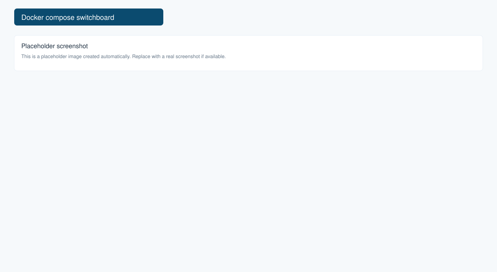

# Compose Switchboard



A local browser UI for starting, stopping, and restarting selected Docker Compose services.

Compose Switchboard is useful for monorepos and local development environments with many services, where you want to run only the containers needed for the task in front of you.

## Features

- Browser UI with one switch per service
- Start selected services with `docker compose up -d service`
- Stop selected services with `docker compose stop service`
- Restart services from the UI
- Show running/stopped status from Docker Compose
- Group services by project area
- Open service URLs from the dashboard
- Start explicit dependencies along with a selected service

## Quick start

Requirements:

- Go 1.22+
- Docker
- Docker Compose v2

Run the switchboard:

```sh
go run ./cmd/ --config demo/switchboard.json
```

Open:

```text
http://localhost:9090
```

This repository includes a small sample `compose.yaml` with:

- `postgres`
- `auth-api`
- `orders-api`

Turn on `Auth API` in the UI. Compose Switchboard runs auth-api container(`docker compose up -d postgres auth-api`).

Then open:

```text
http://localhost:18081
```

## Configuration

Create `switchboard.json` in the directory where you run the switchboard:

```json
{
  "projects": [
    {
      "name": "my-platform",
      "workdir": "/absolute/path/to/my-platform",
      "composeFiles": ["compose.yaml"],
      "services": [
        {
          "name": "postgres",
          "displayName": "Postgres",
          "group": "core",
          "port": "5432",
          "description": "Shared local database"
        },
        {
          "name": "auth-api",
          "displayName": "Auth API",
          "group": "auth",
          "port": "8081",
          "url": "http://localhost:8081",
          "dependsOn": ["postgres"]
        }
      ]
    }
  ]
}
```

If `services` is omitted, Compose Switchboard discovers service names with:

```sh
docker compose config --services
```

Configured services are nicer because you can add display names, groups, ports, URLs, descriptions, and explicit dependencies.

## Multiple Compose files

If your project layers Compose files:

```json
{
  "composeFiles": ["compose.yaml", "compose.override.yaml"]
}
```

Compose Switchboard runs:

```sh
docker compose -f compose.yaml -f compose.override.yaml ...
```

## Custom port

```sh
go run ./cmd/service-switchboard --addr :9091
```

## Custom config path

```sh
go run ./cmd/service-switchboard --config /path/to/switchboard.json
```

or:

```sh
SWITCHBOARD_CONFIG=/path/to/switchboard.json go run ./cmd/service-switchboard
```

## Safety model

Compose Switchboard runs local Docker Compose commands on your machine. Keep it bound to localhost for local development use.

It does not expose authentication, multi-user permissions, or remote Docker management.
